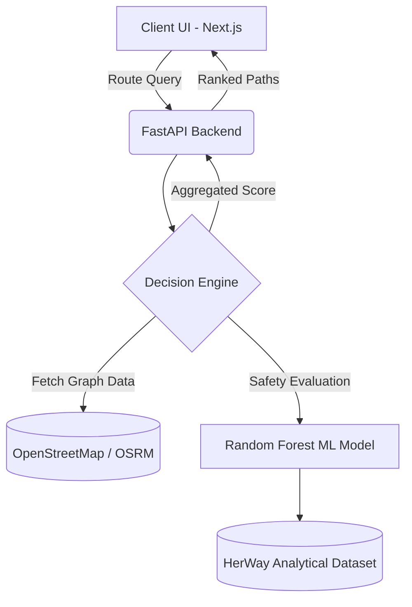

# Project Technical Architecture: HerWay

## 1. Overview and Problem Statement
HerWay is a state-of-the-art web application specifically engineered to combat the vulnerabilities women experience globally while travelling or commuting. Unlike generic applications (Google Maps, Waze) that prioritize efficiency and shortest-path routing, HerWay pivots the fundamental routing heuristics toward safety, incorporating localized crime data and predictive socio-environmental risk models.

## 2. Core Methodologies

### 2.1 Environmental Synthetic Data
Real-world datasets for situational crime prediction are profoundly sparse. While baseline coordinates outline the epicenter of incidents, they omit vital contextual layers. Our system utilizes a synthetically expanded representation of geographic points spanning the Indore region:
*   **Time Shift Adjustments**: Blurring exact moments of historical crime to generalize temporal risks.
*   **Local Geometric Jitter**: Spreading historical pin-drops into gaussian clusters mimicking spatial heat zones.
*   **Crowd & Lighting Dynamics**: Simulating time-of-day dynamics (twilight vs. pitch dark) mapped to standard socio-behavioral crowd estimates.
*   **Emergency Service Proximity**: Calculating Haversine distances to critical responder hubs to establish realistic response-time penalties on route risks.

### 2.2 Machine Learning Pipeline
The backend runs on an optimized **Random Forest Regressor** trained over our contextual feature matrix. The choice of Random Forest prevents overfitting on spatial noise and handles non-linear relationships smoothly.

#### Features Selected:
*   **Spatial**: `latitude`, `longitude`
*   **Temporal**: `hour`, `day_of_week`
*   **Contextual**: `lighting_condition`, `crowd_density`, `police_presence_dist`

The model is tuned using an extensive **GridSearchCV**, iterating over hyperparameters (estimators, depths, split bounds) to converge on a highly precise risk estimation metric. The final output predicts a real-world mapped scalar representing safe navigation confidence.

## 3. System Architecture

### Components:
*   **Frontend**: Built on Next.js 14 utilizing React Server Components for optimal SEO and fast time-to-interactive. Framer Motion provides high-viscosity, micro-interactions for a premium feel. The UI favors a high-contrast Black/White Farm style design.
*   **Backend API**: Leveraging Python's FastAPI. Provides low-latency HTTP resolving, natively handling Pydantic structural validation on queries.
*   **ML Core**: Driven by `scikit-learn` with data pipelining optimized inside heavily vectorized Pandas routines. We deploy using joblib-pickled inference artifacts to ensure inference is bounded tightly to API lifecycles.

## 4. Scalability and Future Prospects
Currently, the prototype generalizes context parameters synthetically. Next phases of development involve interfacing live APIs or IoT triggers to dynamically modify:
1. Live ambient lighting conditions (via street-light grid APIs).
2. Live crowd metadata (Via local carrier tower triangulation data or dense CCTVs).
3. Decentralized verified crowd-sourced risk anomalies (real-time user distress tagging).
